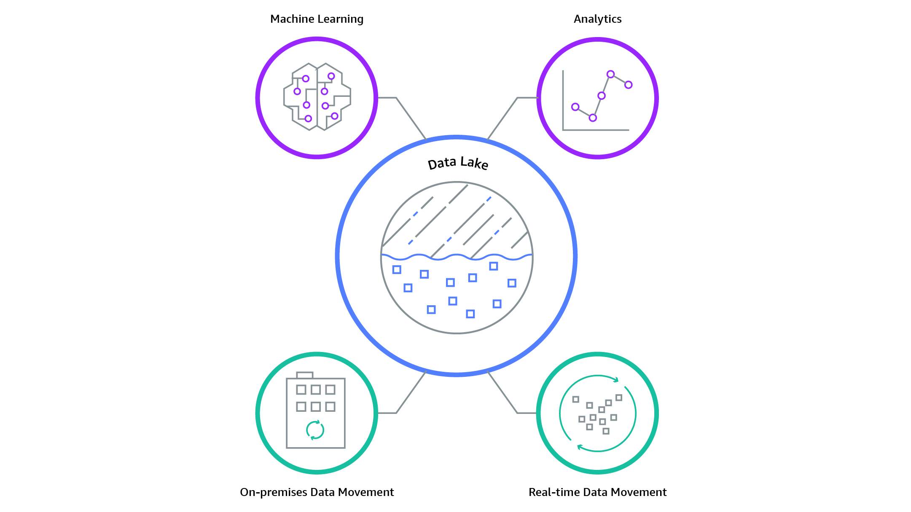

# Introducción

| Contenidos | 
| ---------- | 
| Stakeholders tecnológicos |
| Velocidades en IT |
| Data warehouse |
| Data Mart | 
| Data Lake | 

## Stakeholders Tecnológicos 
- Sistémicos nacionales
   - INAI
   - INEGI

- Sistémicos Internos
   - Clientes B2B
   - Clientes con alto valor (SLA)

- Regulatorios
   - SCT
   - COFEPRIS
   - CNBV

- Partners comerciales
   - Proveedores
   - Outsourcing

- Clientes estándar
   - B2C (sin SLA)

- Sucursales
   - Subsidiarias
   - Filiales
   - Franquicias

## Velocidades en IT

La **velocidad 1** hace referencia a la rapidez con la que se puede desarrollar y deploy una tecnología; en este caso (1) es un tanto lenta pues se espera que no tenga errores al momento de estar trabajando.

   - Sistémicos nacionales
   - Sistémicos internos
   - Regulatorios

La **velocidad 2** no necesita tantas regulaciones para salir a funcionar en el día a día, por lo que el tiempo de desarrollo es mucho menor, pero puede tener fallas al momento de estar trabajando con él.

- Partners comerciales
- Clientes estándar
- Sucursales

 

###  Resumen

|   | Industria IT | Digital IT |
| --- | --- | --- |
| <b>Tipo de solución </b> | Madura, Legacy | Hecho a la medidad | 
| <b>Metodología</b> | Waterfall + Estándares | Ágiles | 
| <b>Objetivo</b> | Eficiencia Operativa | Ventaja competitiva | 
| <b>Atributo Clave</b> | Estabilidad | Velocidad | 
| <b>Propósito Esencial</b> | Dar Confianza | Enganchar y deleitar |
| <b>Director</b> | CTO, CIO | CMO, Chief Digital |
| <b>IT Rol</b> | Keep the lights on |  Socio de innovación |

## Data Warehouse
A data warehouse is a type of data management system that is designed to enable and support business intelligence (BI) activities, especially analytics. Data Warehouses are solely intended to perform queries and analysis and often contain large amounts of historical data.  
 
A data warehouse centralizes and consolidates large amounts of data from multiple sources. Companies use them to gain valuable insights from data, which can improve decision-making.   
Data warehouses typically deal with large data sets. 
 
A typical data warehouse often includes:
- A relational database: to store and manage data
- An **E**xtraction, **L**oading and **T**ransformation solution: for preparing the data
- Statistical Analysis, reporting data
- Tools for visualizing data

 
A data warehouse creates:
- Consistency
- Stability
- Analyzes changes over time

| Bases de datos operativas | Data warehouse | Data Mart |
| --- | --- | --- | 
| <ul><li>Sin catálogos compartidos</li><li>Propósito específico</li><li>Diferentes niveles de normalización</li><li>Redundancia</li><li>Duplicados</li><li>Columnas repetidas</li></ul> | <ul><li>Esquema unificador</li><li>Planeado</li><li>Integrador</li><li>Propósito general</li><li>Desnormalización</li><li>Governance obligatorio</li><li>Desduplicación</li><li>Perfilamiento</li></ul> | <ul><li>Propósito específico</li><li>Uno por área de negocio</li><li>Rápidas para acceder</li></ul>

A **data mart** is a *subject-oriented* database that is often a partitioned segment of an enterprise data warehouse. The subset of data held in a data mart typically aligns with a particular busines unit like sales, finance or marketing.  
 
They accelerate business processes by allowing access to relevant information in a data warehouse within days, as opposed to months or longer.

A **data lake** is a centralized repository that allows you to store all your structured and unstructured data at any scale. You can store your data as-is, withou having to first structure it, and run different types of analytics.  
 
It stores relational data from line of business applications, and non-relational data from other sources.

