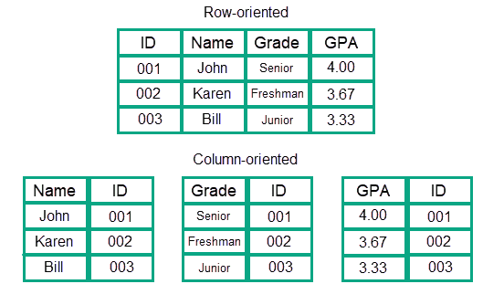

# MonetDB

MonetDb es una base de datos columnar.  
 
- Buenas para leer; malas para escribir
- Son el destino final de los cubos de datos; son como vistas
- Cuando las bases de datos relacionales no son suficientes (ni con índices) las vistas las llevamos a bases de datos columnares.

## Construcción de BD columnaes

Por dentro se crean de la siguiente forma:

Posterior a la creación de estos archivos viene la compresión.

En las bases de datos columnares las operaciones **INSERT**, **DELETE** o **UPDATE** o no son soportadas o son parcialmente soportadas, o tardan muchísimo más que una base de datos relacional.

En lugar de meter tabla por tabla en una BD columnar, mejor insertamos una BIG TABLE.

Lo más óptimo para crear una big table es básicamente hacer joins de todas las tablas que queramos meter y luego esa la pasamos a columnar.

~~~sql
select *
  from actor a join film_actor fa using (actor_id)
       join film f using (film_id)
       join film_category fc using (film_id)
       join category c using (category_id)
       join inventory i using (film_id)
       join rental r using (inventory_id)
       join payment p using (rental_id);

~~~ 

## Instalar MonetDB

Con lo siguiente bajamos monetdb y lo tenemos corriendo en un contenedor de nombre monetdb

~~~sh
docker volumne create monet-data
doker stop monetdb
docker rm monetdb
docker run \
       -v monet-data:/var/monetdb5/dbfarm \
       -p 50001:50000 \
       --name monetdb \
       -d monetdb/monetdb:latest
~~~

Ahroa para correr comandos sobre la base de datos
~~~sh
docker exec -it monetdb /bin/bash
# Y adentro podemos crear una base de datos que se llame ITAM
monetdb create -p monetdb ITAM
~~~

Ahora, para entrar en el shell de monetdb, corremos el siguiente comando
~~~sh
docker exec -it monetdb mclient ITAM
~~~

## Pasos para insertar datos

Primero tenemos que crear un volumen para luego agregárselo al container
~~~sh
docker volume create monet-data
~~~

Ahora creamos el contenedor donde metemos el volumen en la carpeta datasets
~~~sh
docker run -d --name monetdb -p 50001:50000 --mount source=monet-data,target=/datasets monetdb/monetdb
~~~

Metemos los datos que queremos adentro del volumen
~~~sh
docker cp ecobici_2010_2017-mitad.csv monetdb:/datasets/ecobici_2010_2017-mitad.csv
~~~

Hasta este punto ya tenemos listo el contenedor con el volumen adentro y los datos cargados.  
 
Entramos al bash de monetdb
~~~sh
docker exec -it monetdb bash
~~~

Dentro de la terminal de monet, creamos la base de datos “ecobici”
~~~sh
monetdb create -p monetdb ecobici
~~~

Dentro de la terminal de monet, entramos a la base de datos (con usuario y contraseña “monetdb”)
~~~sh
mclient -u monetdb -d ecobici
~~~

Dentro del sql, creamos el usuario y contraseña “ecobici”.
~~~sql
CREATE USER "ecobici" WITH PASSWORD 'ecobici' NAME 'EcoBici Explorer' SCHEMA "sys";
CREATE SCHEMA "ecobici" AUTHORIZATION "ecobici";
ALTER USER "ecobici" SET SCHEMA "ecobici";
\q
~~~

Dentro de la terminal de monet, entramos a la base de datos con usuario ecobici que acabamos de crear
~~~sh
mclient -u ecobici -d ecobici
~~~

Insertamos el comando de sql para crear la tabla que necesitamos
~~~sql
create table ecobici_historico (
  genero_usuario  VARCHAR(80),
  edad_usuario  VARCHAR(80),
  bici  VARCHAR(80),
  fecha_retiro  VARCHAR(80),
  hora_retiro_copy  VARCHAR(80),
  fecha_retiro_completa  VARCHAR(80),
  anio_retiro  VARCHAR(80),
  mes_retiro  VARCHAR(80),
  dia_semana_retiro  VARCHAR(80))
~~~

Con el comando copy, pegamos los datos de la base desde la carpeta que creamos
~~~sql
copy offset 2 into ecobici_historico from '/datasets/ecobici_2010_2017-mitad.csv' on client using delimiters ',',E'\n',E'\"' null as ' ';
~~~