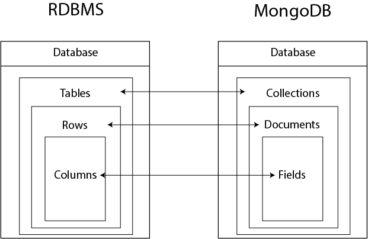

# Mongo DB

Mongo DB vió la luz por primera vez en 2009. Se diseñó para ser escalable desde un inicio; el desempeño y el fácil acceso a los datos fueron parte desde un inicio.  
 
Es una **base de datos documental**, lo cual nos permite guardar objetos anidados, tanto como se desee. No pide ningún tipo de esquema, por lo que los documentos pueden tener campos que ningún otro documento tenga.  
 
Aunque la flexibilidad nos llevaría a no tomarlo en serio, realmente hay aplicaciones enormes que lo usan hoy en día.

## Pasos para crear contenedor de docker con mongo
~~~sh
# Creamos un directorio para poder guardar todo ahí
mkdir data
# Creamos el docker en sí
docker run -p 27017:27017 \
      # Esto crea un volumen
       - v ~/data:/data/db \
      # Esto también crea un volumen
      # Un puto volumen es básicamente los datos
      # Después puedes usar mongoimport para meterlos a la base de datos
       - v ~/mongodb-sample-dataset:/mongodb-sample-dataset \
      # Esto nombra el docker
       --name mongo \
      # No tengo idea de qué haga esto
       -d mongo
~~~

Si queremos parar un docker hacemos los siguiente 

~~~sh
# Esto para el contenedor
docker stop mongo
# Esto elimina el contenedor
docker rm mongo
~~~

Si queremos correr el contenedor desde la terminal hacemos lo siguiente
~~~sh
# Esto nos mete directo a la terminal de mongo
docker exec -it mongo mongosh
# También podemos primero entrar a la máquina de bash
docker exec -it mongo bash
# Ya estando adentro podemos llamar 
mongosh
# Y nos lleva al mismo lugar
~~~

## Usando MongoDB
Usamos `mongosh` para tener una línea de comandos.  
 
Creamos una base de datos que se llame books.  
Técnicamente no es una base de datos hasta que no agreguemos documentos.
 ~~~js
 use book
 ~~~

Vamos ahora a insertar un documento:

~~~js
 var documento = {
   name: "New York",
   population: 222222,
   last_census: ISODate("2016-07-01"),
   famous_for: ["The MOMA", "Food", "Statue of Liberty"],
   mayor: {
      name: "Bill de Blasio",
      party: "D"
   }
};

// Ahora sí lo insertamos
db.towns.insertOne(documento)
~~~

Si queremos insertar datos desde un volumen que ya habíamos metido tenemos que hacer lo siguiente:

~~~sh
# Esta opción es si quieres hacerlo directo desde la terminal de zsh
docker exec mongo mongoimport --db data_base_name --collection collection_name --file ./path/to/file.json

# Esta opción es si primero entras al bash de mongo
docker exec -it mongo bash
mongoimport --db data_base_name --collection collection_name --file ./path_to_file.json
~~~

Es importante destacar que podemos agregar nuevamente exactamente el mismo objeto pues son distintos para mongo. Cada vez se les crea un nuevo ID, este se llama _id.

Recordemos la estructura de las colecciones en mongo
   

   
Analicemos, pues, lo que está haciendo la última línea del código:

1. **db** es el objeto con el que `mongosh` se refiere a la base de datos, que en este caso es *book*. Se tiene que **towns** es una colección adentro de la base de datos (como se puede ver en la imagen de arriba)
2. La variable que se definió como documento es un *pseudo* json que contiene los datos que nos importan. Es pseudo porque tiene objetos que no son texto plano, como lo es la fecha, con la cual se puede trabajar de manera especial a si fuera solamente texto.

También se pueden insertar varios a la vez con el siguiente comando

~~~js
db.towns.insertMany(
   [
      {
         name: 'new york',
         population: 1234,
         lastCensus: ISODate('2016-07-01'),
         famousFor: ['the moma', 'food', 'the met'],
         mayor: {
            name: 'bill de blasio',
            party: 'D'
         }
      },
      {
         name: 'london',
         population: 2345,
         lastCensus: ISODate('2018-07-01'),
         famousFor: ['the british museum', 'fish and chips', 'the met'],
         mayor: {
            name: 'sadiq khan',
            party: 'L'
         }
      }
   ]
)
~~~
Notemos que el formato es el siguiente.
` db.towns.insertMany([{documento_1},{documento_2}, ...])`

 

## Making Queries
`db.collection.find(query, projection, options)`

| Parameter | Type | Description |
| --------- | ---- | ----------- | 
| query | document (json) | Optional   Specifies selection filter using query operators |
| projection | document | Optional   Specifies the fields to return in the documents that match the query filter |
| options | document | Optional   Specifies additional options for the query | 

### General Examples

| Goal | Query | 
| ---- | ----- | 
| Find all documents in a collection | `db.bios.find()` |
| Find document where id equals 5 | `db.bios.find({ _id: 5})` |
| Find document where field *last* in the *name* embedded document equals 'hopper' | `db.bios.find({"name.last":"hopper"})`|

### Examples using operators

| Type | Operator | Description |
| --- | --- | --- | 
| Comparison | $eq | Matches values that are equal to a specified value |
| Comparison | $gt | Matches values that are greater than a specified value |
| Comparison | $gte | Matches values that are greater than or equal to a specified value |
| Comparison | $in | Matches any of the values specified in an array | 
| Comparison | $lt | Matches values thar are less than a specified values | 
| Comparison | $lte | Matches values that are less than or equal to a specified values | 
| Comparison | $ne | Matches all values that are not equal to a specified value |
| Comparison | $nin | Matches none of the values specified in an array |
| Logical | $and | Joins query clauses with a logical AND |
| Logical | $not | Inverts the effect of a query expression | 
| Logical | $nor | Joins query clauses with a logical NOR |
| Logical | $or | Joins query clauses witha logical OR |
| Evaluation |  $mod | Performs a modulo operation on the value of a field |
| Evaluation | $regex | Selects documents where values mathc a specified regular expression |
| Evaluation | $text | Performs text search |
| Array | $all | Matches arrays that contain all elements specified in the query | 
| Array | $elemMatch | Selects documents if element in the array field matches all the specified $elemMatch conditions | 
| Array | $size | Selects documents if the array field is a specified size |
| Projection | $slice | Limits the number of elements projected form an array |

**$in**  
 Find documents with id either 5 or 6
 ~~~js
db.bios.find(
   {id: {$in: [5,6]}}
)
~~~

**$gt**  
Find documents where birth is grater than 1950-01-01
~~~js
db.bios.find(
   { birth: { $gt: new Date('1950-01-01') } }
)
~~~

**$regex**  
Find documents where name.last starts with thel letter N
~~~js
db.bios.find(
   {'name.last': {$regex: /^N/}}
)
~~~

### Example for ranges
Finds the documents where birth is between 1940-01-01 and 1960-01-01

~~~js
db.bios.find(
   {
      birth: { $gt: new Date('1940-01-01'), $lt: new Date('1960-01-01')}
   }
)
~~~

### Multiple conditions 
Finds the documents where birth is greater than a date and death field does not exist
~~~js
db.bios.find(
   {
      birth: {$gt: new Date('1920-10-10')},
      death: {$exists: false}
   }
)
~~~

### Query for embedded documents
Returns the documents where the embedded document name is exactil as follows, includind the order

~~~js
db.bios.find(
   {
      name: {first: 'Mariano', last: 'Alcaraz'}
   }
)

// It is important to note that the match will not work if the document is something like the next ones

{
   first: 'Mariano',
   aka: 'Marianito',
   last: 'Alcaraz'
}

// Or

{
   last: 'Alcaraz',
   first: 'Mariano'
}

// If we want to match any of the documents above we would instead use something like the following 

db.bios.find(
   {
      'name.first': 'Mariano',
      'name.last': 'Alcaraz'
   }
)
~~~

### Query Arrays
The following returns documents where the array field *contribs* contains the element "UNIX"

~~~js
db.bios.find( {contribs: 'UNIX'})
~~~

This returns documents where the array field contribs contains the element 'ALGOL' or 'LISP'
~~~js
db.bios.find(
   {
      contribs: {$in: ['ALGOL', 'LISP']}
   }
)
~~~

This returns documents where the array field contribs contains both the elements 'ALGOL' and 'LISP'

~~~js
db.bios.find(
   { 
      contribs: {$all: ['ALGOL', 'LISP']}
   }
)
~~~

This returns the documents where the array size of contribs is 4
~~~js
db.bios.find(
   {
      contribs: {$size: 4}
   }
)
~~~

This returns the documents where the array dim_cm contains at least one element whose value is greater than 25

~~~js
db.inventory.find(
   {dim_cm: {$gt: 25}}
)
~~~

This returns the documents where dim_cm contains elements that in some combination satisfy the query contidions. E.g. one element can satisfy the greater than 15 condition and another element can satisfy the less than 20 condition, or a single element can satisfy both:

~~~js
db.inventory.find(
   {
      dim_cm: {$gt: 15, $lt: 20}
   }
)
~~~

This returns the documents where the dim_cm array contains at least one element that is both greater than 15 and less than 20.

~~~js
db.inventory.find(
   {
      dim_cm: { $elemMatch: {$gt: 15, $lt:20}}
   }
)
~~~

This returns the documents where the second element in the array dim_cm is greater than 25

~~~js
db.inventory.find(
   {
      'dim_cm.1': {$gt: 25}
   }
)
~~~

### Query with `$slice`operator
Este operador rebana un arreglo de un documento para regresaronso solamente N elementos

Esto regresará todos los documentos, pero su array *purchase* solo tendrá el primer elemento. Acepta números negativos para rebanar de izquierda a derecha y negativos para hacerlo de derecha a izquierda.

~~~js
db.articles.find(
   {},
   {
      'purchase': {$slice: 1}
   }
)
~~~

También se puede usar para traer solo un elemento en una posición específico del array. Aquí nos posicionamos en el índice 1 y a partir de ahí traemos un elemento (el segundo elemento y ya)

~~~js
db.articles.find(
   {},
   {
      purchase: {$slice: [0,1]}
   }
)
~~~

## Agregaciones

Las agregaciones en MongoDB se hacen a través de pipelines, estos tienen la siguiente estructura 

~~~js
function_f(w).function_g(x).fucntion_h(y).function_i(z)
~~~

Un pipeline primero debe ser definido

~~~js

var pipeline = [
   {
      "$match": {
         "level": "Excellent"
      }
   },
   {
      "$sort": {
         "name": -1
      }
   },
   {
      "limit": 1
   },
   {
      "$unset": [
         '_id', 'name', 'level'
      ]
   }
];

~~~

Para ejecutarlo corremos lo siguiente
~~~js
db.courses.aggregate(pipeline)
~~~

### Stage `$match`

Es la primera stage en los pipelines de agregacipon. Es similar al find()
También podemos hacer projection usando `$project`

~~~js
db.univese.aggregate(
   [
      {$match: {country: 'Spain', city:'Salamanca'}}
   ]
);

db.universe.aggregate(
   [
      {$match: {country: 'Spain', city:'Salamanca'}},
      {$project: {_id: 0, country: 1, city: 1, name: 1}}
   ]
)
~~~

### Stage `$group` 

Este es el **group by** de mongodb, y el corazón de operaciones como count, sum, avg, etc...

Tiene elementos de sintaxis obligatorios ocmo lo es el **_id**, y se tiene que llamar así, pero duespués le podemos cambiar el nombre usando un `$project`.  
 
El atributo por e cual vamos a agrupar debe ir con la notación `$` como si se tratara de una variable y entrecomillado.  
 
Si se desea hacer una agrupación de todos los documentos, sin armar grupos, entonces ponemos null en el _id al momento de especificar en group.

~~~js
db.univers.aggregate(
   [
      {$match: {country: 'spain', city:'salamanca'}},
      {$project: {_id:0, country:1, city:1, name:1}},
      {$group: {_id: '$name', conteo:{$sum:1}}},
      {$project: {_id:0, 'uni': '$_id'}}
   ]
)
~~~

### Stage `$out` 
Toma la ejecución de toda la salida del pipeline y lo guarda en otra colección

~~~js
db.univers.aggregate(
   [
      {$match: {country: 'spain', city:'salamanca'}},
      {$project: {_id:0, country:1, city:1, name:1}},
      {$group: {_id: '$name', conteo:{$sum:1}}},
      {$project: {_id:0, 'uni': '$_id'}},
      {$out: 'miranomas'}
   ]
)
~~~

### Stage `$unwind` 

Si nuestros documentos tienen arrays, el stage `$unwind` nos permite llegar a todos los datos que estén en ellos. Lo que hace es eplotar el array de un documento; toma cada uno de los N elementos y los clava a N copias del atributo que lo contiene.  
 
Deja cada uno de los nuevos documentos con el mismo _id que el original, solo cambia el valor del atributo que queremos descomponer.

~~~js
db.universe.aggregate(
   [
      {$match: {name: 'USAL'}},
      {$unwind: '$studens'}
   ]
)
~~~

Así, podríamos calcular el promedio de alumnos de 2014 a 2017

~~~js
db.universe.aggregate(
   [
      {$unwind: '$students'},
      {$project: {_id:0, name:1, 'students.year':1, 'studens.number':1}},
      {$group: {_id: '$name', promedio_alumnos: {$avg: '$students.number'}}},
      {$project: {_id:0, 'uni':'$_id', promedio_alumnos:1}}
   ]
)
~~~

Aquí están algunas de las funciones que se pueden usar en el group

| Función | Descripción |
| ---- | --- |
| $addToSet | Después de agrupar, agrega elementos individuales a un array | 
| $avg | Promedio |
| $count | Conteo |
| $first | Regresa el primer documento o diccionario de cada grupo |
| $last | Regresa el último documento de cada grupo |
| $max | Regresa el máximo de cada grupo | 
| $mergeObjects | Después de armar los grupos, combina los objetos que correspondan al grupo en uno solo |
| $min | Regresa el mínimo de cada grupo |
| stdDevPop | Regresa la desviación estándar de la población de cada grupo |
| $sum | Suma acumulativa de cada grupo | 

### Stage `$sort` & `$limit`

El sort y limit pueden usarse como stage de un pipeline de agregación, o puede usarse como lo hemos hecho antes para ordenar resultados individuales.

~~~js
db.collection.aggregate([
    { $group: { _id: <expression>, count: { $sum: 1 } } },
    { $sort: { count: -1 } }
])
~~~

### Stage `$sortByCount`

~~~js
 db.artwork.aggregate([
    { $unwind: "$tags" },
    { $sortByCount: "$tags" }
] )
~~~ 

