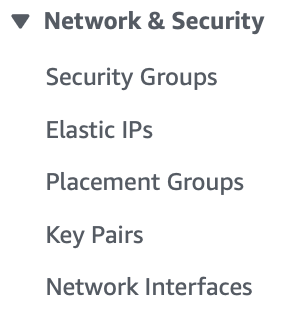
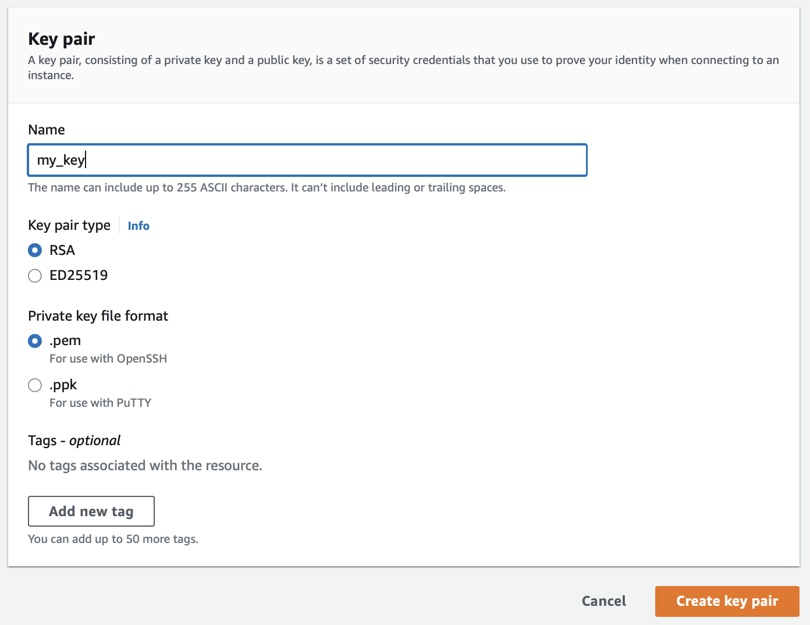

# Creación de SSH key

Para este paso debes estar en la página de EC2 en AWS.

### Paso 1
Busca en la barra izquierda el apartado de **Network & Security** y selecciona **Key Pairs**; posterirormente selecciona `Create Key Pair` en la parte superior derecha.

### Paso 2

Introduce el nombre que deseas que tenga tu llave. Y deja todo lo demás igual, así ya están bien. Luego selecciona `Create Key Pair`.

### Paso 3

Ahora es momento de poner la llave en su lugar adecuado.  
Es importante destacar que justo ahora tu llave se encuentra en la carpeta de descargas, y nosotros queremos que esté en la carpeta ocula `.ssh` que se encuentra en tu directorio de home.

Para ello corre el siguiente comando en la terminal:

~~~sh
mv ~/Downloads/[KEY NAME].pem ~/.ssh/[KEY NAME].pem
~~~

Ahora ya tienes tu llave guardada donde debe ir