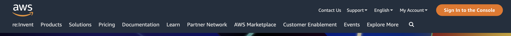
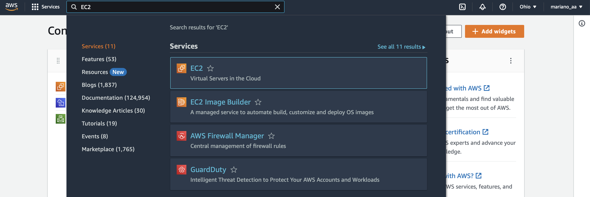
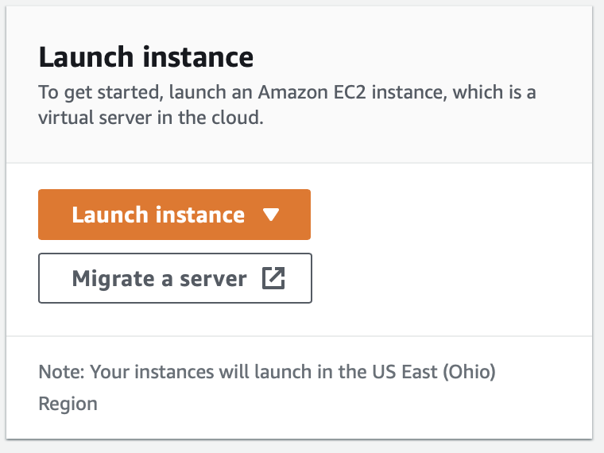
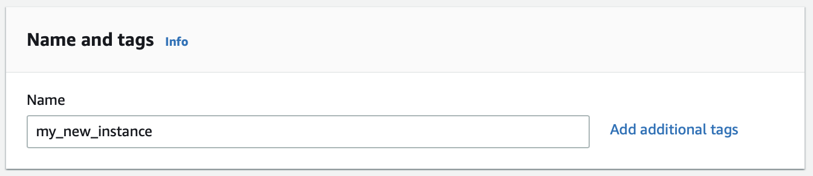
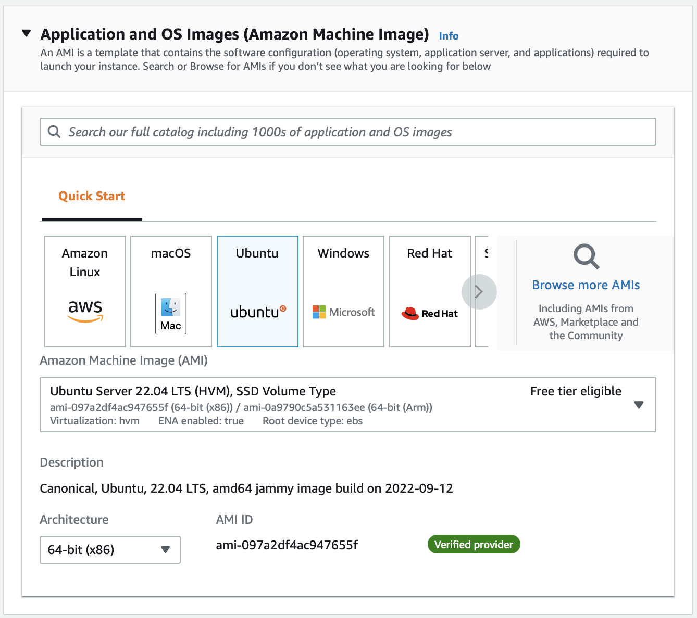
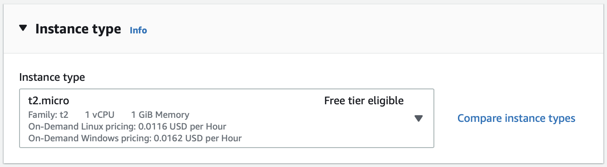
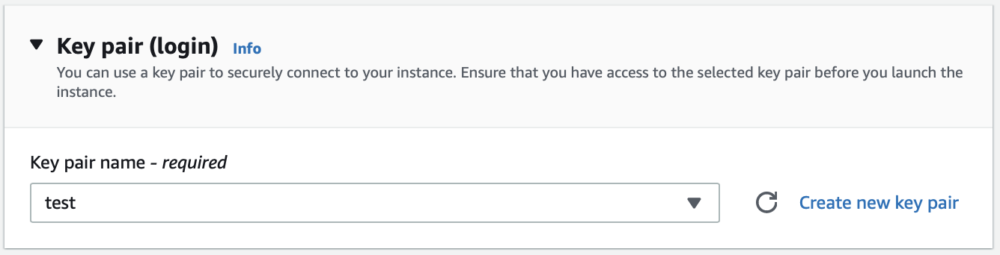
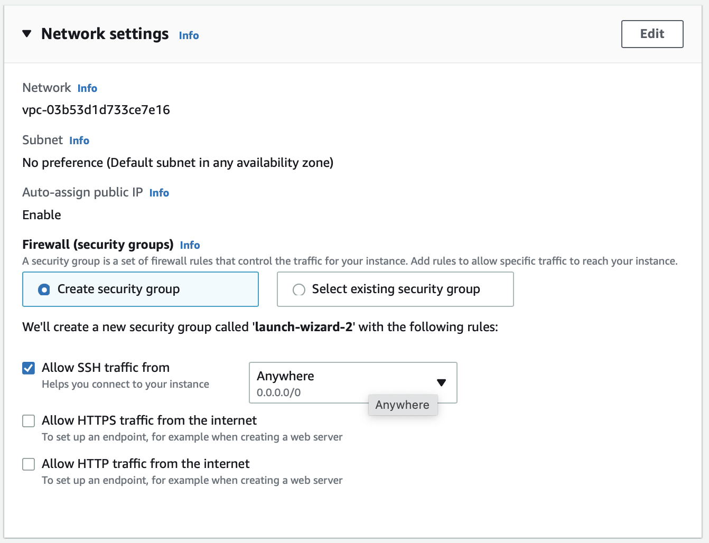
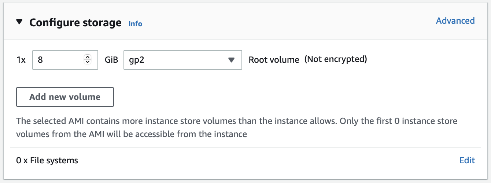
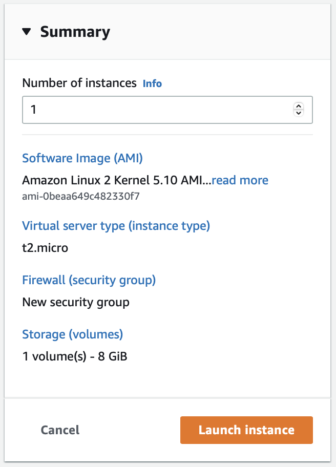

# Incializar una máquina en la nube

Para esto usaremos [Amazon Web Services](https://aws.amazon.com).  

### Paso 1
Crea o ingresa a tu cuenta de AWS.

### Paso 2
En la barra de búsqueda introduce el nombre **EC2** y selecciónalo.

### Paso 3
Ahora crearemos la nueva instancia (esta es la computadora).  
Busca la sección llamada ***Launch Instance***

### Paso 4

Ahora, es momento de especificar todo lo que deseemos.

1. Nombre

2. Selecciona el sistema operativo. Yo siempre uso ubuntu.

3. Elige el tipo de instancia. Yo siempre uso la que es elegible para **free tier**.

4. Elige la **SSH** key que vas a usar. Yo ya tengo una que se llama test.pem, pero para crear el tuyo ver el siguiente link <a href='./create_key_pair.md'>create_key_pair</a>

5. Especifica los ajustes de conexión. Yo ya tengo un grupo de seguridad hecho, pero básicamente solo elegí que se pudiera acceder desde cualquier dirección IP porque sino sería un pedo estar modificando eso cada vez.
 

6. Elige el almacenamiento.

7. Activa la instancia

