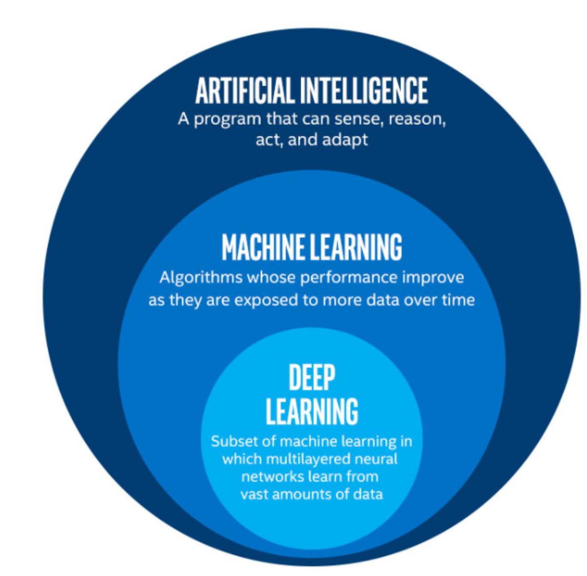

# Introducción

## AI, ML & DL

- **Inteligencia Artificial**: Un programa que puede sentir, razonar, actuar y adaptarse.
   - Darle a las máquinas la habilidad de procesar información y resolver problemas desde un acercamiento que pretende imitar el comportamiento humano
- **Machine Learning**: Algoritmos cuyo performance mejora conforme se van exponiendo a más datos sobre el tiempo. Es un subconjunto de Inteligencia Artificial.
- **Deep Learning**: Un subconjunto de aprendizaje de máquina con redes neuronales multicapa que requiere de muchos datos

## Contexto
Los factores que han permitido el desarollo de las redes neuronales son los siguientes:

- 5 décadas de investigación
- Lots of data (internet)
   - Han ido aumentando de forma exponencial, al igual que el número de neuronas y conexiones
- Computing power (GPU)
- Representation Learning
- Culture of collaborative science
- Resources from large corporations

## Tipos de Aprendizaje

### Aprendizaje Supervisado
Es el tipo de aprendizaje más común. Se entranan los modelos usando parejas de daots `{x,y}`. Ejemplo de ello, **regresiones** y **clasificación**.

### Aprendizaje No Supervisado
No conocemos las etiquetas *y*, y estamos intersados en entender o manipular los datos. Ejemplo de ellos son **clustering**, **reducción de dimensiones**, **detección de anomalías**.

### Reinforcment Learning
No existen las *x* y *y*, sino más bien son etapas, acciones y recompensas. Existe un agente que debe aprender a interactuar con el medio para maximizar su recompensa. Ejemplo de ello son los **videojuegos**.

## Parámetros e Hiperparámetros

### Parámetros
Son variables "*internas*" del modelo. Se estiman de los datos. Ejemplo de ellos son los **pesos** en una regresión.

### Hiperparámetros
Son variables "*externas*" del modelo. Se ajustan de forma manual a través de prueba y error (validation). Ejemplo de ello son los **grados del polinomio** en una regresión, o el **número de neuronas** en una red neuronal.

## Datasets
Para que aprender tenga sentido, el conocimiento adquirido debe poderse extrapolar a nuevos eventos. Es por ello que se necesitan los siguientes datasets.  
 
Es importante destacar que a pesar de que los distintos conjuntos de datos son disjuntos, se asume que todos los datos provienen del mismo fenómeno, o son generados por la misma distribución de probabilidad.

### Training Set
Initial set used to estimate the values for our parameters {*w*i}

### Validation Set
Una vez que se han encontrado los valores de los pesos {*w*i}, we use this set to validate how well the model performs on data never seen before (how well it generalizes).  
 
If the validation performance is poor in comparison with the training performance, then we must change some hyper-parameters to improve it (shorten the generalization gap).

### Test Set
Used for final performance evaluation. Data samples in this set were never considered neither to learn the parameters nor the hyperparameters. Therefore, generalization is valid.  
This evaluation gives us the expected level of performance for our model once in production.

## Cross Validation
Some times, we might not have enough data for training a large model properly. If such is the case, we can rely on a **cross-validation** approach.  
Train with subsets, and select the best performing model.

