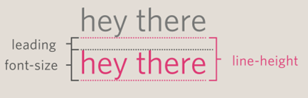

# **Text**

| Contenido | Notas |
| --- | --- |
| Typeface Terminology |font-family |
| Size of type | font-size |
| Weight of font | font-weight | 
| Font style | font-style | 
| Upper and lower case | text-transform | 
| Underline and strike | text-decoration | 
| Leading | line-height |
| Kerning | letter-spacing word-spacing |
| Alignment | text-align | 
| Vertical Alignment | vertical-align |
| Indenting Text | text-indent |
| Drop Shadow | text-shadow | 
| First Letter/Line | :first-letter :first-line | 
| Styling Links | :link :visited :hover :active |
| Responding to Users | :hover :active :focus |

 

## Typeface Terminology &nbsp;&nbsp;&nbsp; `font-family`

### Serif
Son las que son buenas para textos impresos porque tienen detalles al final.

### Sans-serif
Son como las arial, que son mejores para medios digitales.

### Monospace
Todas las letras miden lo mismo, por ejemplo, una *i* mediría lo mismo que una *m*.

### Weight
Light, medium, bold, black

### Style
Normal, italic, oblique

### Stretch
Condensed, regular, extendend

 

Al momento de especificar la fuente, puedes separarlas por comas, así en caso de que el usuario no los tenga descargados use otro de la lista.

~~~css
body {
    font-family: Georgia, Times, serif;
}
~~~

 

## Size of Type &nbsp;&nbsp;&nbsp; `font-size`
 

| Pixels | Percentages | EMS |
| --- | --- | --- |
| 12px | 75%* | 1.3em** | 

\* El tamaño por defecto es de 16px, por lo que 75% correspondería a 12px. Si especificas en el body que todo el texto debe ser 75%, entonces si luego haces otra regla más específica de 75% ahora corresponderá a 9px.

\** Un *em* es el equivalente a la anchura de la letra m (cambiará dependiendo de la fuente que uses).  
 

## Font Weight &nbsp;&nbsp;&nbsp; `font-weight`
 

~~~css
p {
    font-weight: bold;
    font-weight: normal;
}
~~~

## Font Style &nbsp;&nbsp;&nbsp; `font-style`
 

~~~css
p {
    font-style: normal;
    font-style: italic;
    font-style: oblique;
}
~~~ 
 

## Upper and Lowercase &nbsp;&nbsp;&nbsp; `text-transform`
 

~~~css
h1 {
    text-transform: uppercase;
}

h2 {
    text-transform: lowercase;
}

p {
    text-transform: capitalize;
}
~~~
 

## Underline & Strike &nbsp;&nbsp;&nbsp; `text-decoration`
 

~~~css
a {
    /* Elimina cualquier decoración aplicada previamente */
    text-decoration: none;
    text-decoration: underline;
    text-decoration: overline;
    text-decoration: line-through;
    /* Esto da una animación de flash encendido y apagado */
    text-decoration: blink;
}
~~~

## Leading &nbsp;&nbsp;&nbsp; `line-height`
Es el espacio vertical que existe entre las líneas del texto.  
La parte de una letra que llega bajo la línea base se llama **descender**, mientras que el punto más alto de la letra se llama **ascender**.  
 
Leading se mide from the bottom of the descender on one line to the top of the ascender on the next.

Leading es la diferencia entre el tamaño de la fuente y el tamaño de la línea.

~~~css
p {
    line-height: 1.4em;
}
~~~
 

## Kerning &nbsp;&nbsp;&nbsp; `letter-spacing & word-spacing`
Es el espacio entre cada letra. Normalmente es bueno darlos en ems.

~~~css
h1 {
    letter-spacing: 0.2em;
    word-spacing: 1em;
}
~~~ 
 

## Alignment &nbsp;&nbsp;&nbsp; `text-align`
Can take one of the next four values:
- left
- right
- center
- justify

~~~css
p {
    text-align: justify;
}
~~~
 

## Vertical Alignment &nbsp;&nbsp;&nbsp; `vertical-align`
It is **NOT** intended to vertically align text in the middle of a block level element such as p or div.

It **IS** used with inline elements such as `, <em>, <strong>`. Es como para acomodar dónde se ve la imagen, si el texto que tiene al lado queda arriba, en medio, abajo, etc.

- baseline
- sub
- super
- top
- text-top
- middle
- bottom
- text-bottom

~~~css
#six-months {
    vertical-align: text-top;
}
~~~
 

## Indenting Text &nbsp;&nbsp;&nbsp; `text-indent`
Te permite indentar la primera línea de texto del elemento especificado. También se pueden usar valores negativos para mandar cosas a la chingada.

~~~css
h1 {
    text-indent: -9999px;
}
p {
    text-indent: 20px;
}
~~~

## Drop Shadow &nbsp;&nbsp;&nbsp; `text-shadow`
Se usa para crear una versión más oscura de la palabra atrás de ella y un poco desfasada.  
El valor es algo complicado: 
- **first length**: how far to the left or right the shadow should fall
- **second value**: the distance to the top or bottom that the shadow should fall
- **third value**: este es opcional, e indica la cantidad de blur que se le aplicará
- **fourth value**: es el color de la sombra

~~~css
p {
    text-shadow: 1px 1px 0px #000000;
}
~~~

## First Letter or Line &nbsp;&nbsp;&nbsp; `:first-letter` or `:first-line`
Técnicamente, estas no son propiedades, y se conocen como **pseudo-elements**.  
Especificas el pseudo-element al final del selector.

~~~css
p.intro:first-letter {
    font-size: 200%
}
p.intro:first-line {
    font-weight: bold;
}
~~~

## Styling links &nbsp;&nbsp;&nbsp; `:link ...`
- **:link** &nbsp;&nbsp;&nbsp;-->&nbsp;&nbsp;&nbsp; Te permite poner el color del link antes de ser visitado
- **:visited** &nbsp;&nbsp;&nbsp;-->&nbsp;&nbsp;&nbsp; Self explanatory
- **:hover** &nbsp;&nbsp;&nbsp;-->&nbsp;&nbsp;&nbsp; Cuando el cursor pase sobre el link
- **:active** &nbsp;&nbsp;&nbsp;-->&nbsp;&nbsp;&nbsp; Cuando el link esté abierto

~~~css
a:link {
    color: deeppink;
    text-decoration: none;
}

a:visited {
    color: black;
}

a:hover {
    color: deeppink;
    text-decoration: underline;
}

a:active {
    color: darkcyan;
}
~~~

## Responding to users &nbsp;&nbsp;&nbsp; `:hover ...`
Son tres pseudo-elements que te permiten cambiar la apariencia cuando el usuario los está usando.

**:hover**  
Cuando el usuario pasa el mouse sobre el elemento.

**:active**  
Por ejemplo, cuando un botón está siendo presionado o un link está siendo apretado. Suele usarse como para que se sienta que sí se está tocando de verdad, a lo mejor moviendo un poco de posición el objeto.

**:focus**  
La verdad no entiendo cuándo un elemento está enfocado.

~~~css
input.submit:hover {
    background-color: #987654;
}
input.submit:active {
    background-color: chocolate;
}
input.text:focus {
    color: #a3f321;
}

