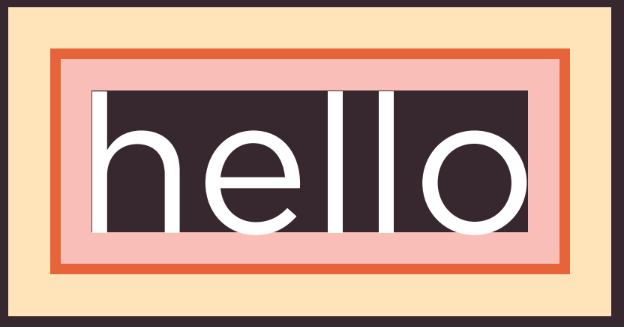

# Boxes

| Contenido | Notas |
| --- | --- |
| Box dimensions | width height |
| Limiting width | min-width max-width |
| Limiting height | min-height max-height |
| Overflowing content | overflow |
| Border width | border-width |
| Border style | border-style |
| Border color | border-color |
| Shortcuts for borders | border |
| Padding | padding |
| Margin | margin | 
| Centering content | text-align, margin |
| Change inline & block content | display |
| Hiding boxes | visibility |
| Border image | border-image |
| Box shadows | box-shadow | 
| Rounded corners | border-radius |
| Eliptical shapes | border-radius | 

  

## Box Dimensions  `width` & `height`
By default, a box is sized just big enough to hold its contents.  
You can use pixels, percentages or ems. When you are using % the size of the box is realtive to the size of the browser window, or if the box is encased within another box, it is a percentage of the size of the containing box.

~~~html

    
 Lorem ipsum dolor sit, amet consectetur adipisicing elit. Deleniti, molestiae vitae esse repellat dolores tenetur placeat dolor. Expedita nisi earum harum dolorum nihil eaque sequi?
    

~~~

~~~css
div.box {
    height: 300px;
    width: 300px;
    background-color: blue;
}

p {
    height: 75%;
    width: 75%;
    bacground-color: #0088dd;
}
~~~

En este caso el paragraph va a tener dimensiones del 75% de los 300 pixeles de la caja que lo contiene (225px).

## Limiting Width `min-width` & `max-width`
- **min-width** especifica el tamaño más pequeño que la caja puede tomar
- **max-width** es el tamaño máximo, esto es útil cuando se quieren hacer diseños adaptables.

## Limiting Height `min-height` & `max-height`
El problema con esto es que si se usa demasiado espacio se puede ver horrible. Para eso se puede usar *overflow*.

~~~css
p {
    min-height: 10px;
    max-height: 30px;
}
~~~

## Overflowing Content `overflow`
Esta propiedad le dice al buscador que hacer si el contenido de una caja es más grande que la caja misma, y puede tener uno de los dos siguientes valores: 
- **hidden**: simplemente no lo muestra si no cabe
- **scrolll**: agrega un scrollbar a la caja para que los usuarios puedan verlo. La neta se ve horrible.

~~~css
p.one {
    overflow: hidden;
}

p.two {
    overflow: scroll;
}
~~~

## Border, Margin & Padding
Cada box tiene disponibles tres propiedades para controlar su apariencia: 

| BORDER | MARGIN | PADDING |
| ------ | ------ | ------- |
| Separa la orilla de una caja con la otra | Están afuera del borde, se puede agrandar el margen para crear más espacio entre dos boxes juntas | Es el espacio entre el borde de la box y cualquier contenido dentro de ella |

Si especificas width, entonces cualquiera de las propiedades arriba se agrega a lo especificado.

- **Color crema**: Marging
- **Color naranja fuerte**: Border
- **Color naranga claro**: Padding

## Border Width `border-width`
El valor de esta propiedad puede ser cualquiera de los siguientes:
- Pixels
- thin
- medium
- thick

Puedes controlar el tamaño individual de cada lado del borde usando las siguientes propiedades:
- border-top-width
- border-right-width
- border-bottom-width
- border-left-width

O puedes especificar los cuatro valores al mismo tiempo si pones cuatro valores en la propiedad original en el orden top, right, bottom, left:
- border-width: 2px 1px 1px 2px

~~~css
p.one {
    border-width: 2px;
}
p.two {
    border-width: thick;
}
p.three {
    border-width: 1px 4px 12px 4px;
}
~~~

## Border Style `border-style`
Puede tener los siguientes valores:
| Value | Specification |
| --- | --- |
| solid | single solid line |
| dotted | puntos cuadrados del ancho del borde |
| dashed | líneas cortas |
| double | dos línea sólidas |
| groove | appears to be carved into the page (?)|
| ridge | appears to stick out from the page (?) |
| inset | appears embedded into the page |
| outset | looks like it is coming out of the screen |
| hidden none | no border is shown |

También puedes cambiar el estilo de cada lado individualmente:
- border-top-style
- border-left-style
- border-right-style
- border-bottom-style

~~~css
p.one {
    border-style: solid;
}
p.two {
    border-style: dotted;
}
~~~

## Border Color `border-color`
También es posible cambiarlos individualmente usando:
- border-top-color
- border-right-color
- border-bottom-color
- border-left-color

También puedes cambiarlos individualmente en una sola propiedad si especificas cuatro colores en `border-color` y van en orden top, right, bottom, left.

~~~css
p.one {
    border-color: black;
}
p.two {
    border-color: black, white, red, blue;
}
~~~

## Shortcut for Borders `border`
Con esta propiedad puedes cambiar:
- width
- style
- color

En un solo comando, y en ese orden específico.

~~~css
p {
    border: 3px dotted #000000;
}
~~~

## Padding `padding`
Te permite especificar cuanto espacio debe aparecer entre el contenido de un elemento y su borde.  
Puedes especificarlo usando:
- pixeles
- ems
- porcentajes: porcentaje de la ventana del buscador o de la caja que lo contenga (si está dentro de otra caja).

También puedes especificar diferentes valores de padding para cada lado de la caja usando:
- padding-top
- padding-right
- padding-bottom
- padding-left

O puedes usar un shorthand usando solo padding y dando cuatro valores que irán en el orden de arriba.

~~~css
p {
    padding: 10px;
    padding: 10px 5px 10px 5px;
}
~~~

## Margin `margin`
Controla el espacio entre las cajas. Puedes especificar su valor en:
- pixeles
- ems
- porcentajes

Si una caja está encima de otra los margins se colapsan, est es, se usa el más grande y el otro de descarta.  
Puedes especificar el valor de cada lado del margen:
- margin-top
- margin-right
- margin-bottom
- margin-left

Aunque también puedes usar un shorthand en la propiedad margin al especificar los cuatro valores a la vez.

~~~css
p {
    margin: 20px;
}
~~~

## Centering Content
Si quieres centrar una caja en la página (o dentro de otro elemento), puedes especificar el **left-margin** y **right-margin** a *auto*.  
 
Para centrar un elemento en el centro, primero debes especificar un **width**, de otra forma tomará todo el espacio disponible.  
En algunos buscadores puede ser necesario agregar la propiedad text-align.

~~~css
body {
    text-align: center;
}
p {
    width: 300px;
    margin: 10px auto 10px auto;
    text-align: left;
}
~~~

## Change Inline/Block `display`
Esta propiedad te permite convertir un *inline* element a un *block-level* element, y también se puede usar para esconder un elemento de la página.  
Los valores que puede tomar son:
- **inline**: Hace que un block-level element actúe como un inline element
- **block**: Hace que un inline element actúe como un block-level element
- **inline-block**: Hace que un block-level element fluya como un inline element, manteniendo otras propiedades de un block-level element
- **none**: No muestra el elemento en pantalla. Será como si ahí nunca hubiera habido nada (a diferencia de *hidden* que deja un espacio en blanco donde debería ir)

~~~css
li {
    display: inline;
    margin-right: 10px;
}
~~~

## Hiding Boxes `visibility`
Te permite ocultar boxes de los usuarios, pero deja un espacio en blanco donde el elemento hubiera ido. Puede tomar cualquiera de los siguientes valores:
- hidden
- visible

## Border Images `border-image` 
Esta propiedad aplica una imagen al borde de una box. Toma una background image y la corta en 9 piezas (como si fuera una cara de un cubo rubick).  
Por defecto, las piezas de las esquinas van en las esquinas, pero en cuanto a los lados concierne se puede elegir si queremos que las estire o las repita.  
 
Esta propiedad necesita los siguientes datos:
- URL de la imagen
- Dónde cortar la imagen
- Qué hacer con los lados de la imagen
    - stretch
    - repeat
    - round (como repeat, pero lo hace de forma que queden todos del mismo tamaño)

También es importante que la caja tenga un border width para que se muestre

~~~css
p.one {
    border-image: url('images/dots.gif') 11 11 11 11 stretch;
}
p.two {
    border-image: url('images/dots.gif') 11 11 11 11 round;
}
~~~

## Box Shadows `box-shadow`
Te permite agregar un drop shadow around the box. Funciona exactamente igual que la propiedad text-shadow vista anteriormente.

## Rounded Corners `border-radius`
El valor indica el tamaño del radio en pixeles.  
También puedes especificar cada esquina individualmente usndo:
- border-top-right-radius
- border-bottom-right-radius
- border-bottom-left-radius
- border-top-left-radius

Aunque también puedes especificar todos en la propiedad original en ese orden específico.

~~~css
p {
    border: 5px solid black;
    padding: 20px;
    width: 275px;
    text-align: center;
    border-radius: 10px;
}
~~~

### Eliptical Shapes 
Puedes también especificar diferentes distancias para las partes horizontales y verticales de las rounded corners.  
Por ejemplo, `border-radius: 80px 50px` resultará en una esquina redondeada que quepa en un rectángulo de base 80px y altura 50px.