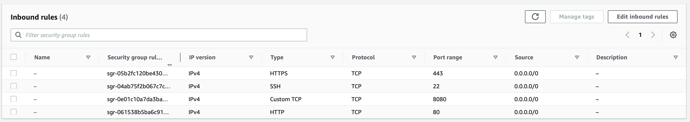

# Uploading Web App to AWS

### Paso 1
Debes crear una instancia de EC2 sobre la cuál vas a montar todo. 
  

Lo más importante en esta instancia es el grupo de seguridad y los puertos a los que está abierto. Debe verse de la siguiente forma:

### Paso 2
Instalar todo lo necesario.

- Instalar **Miniconda** para poder crear el ambiente virtual

~~~sh
sudo apt update

sudo apt upgrade

curl https://repo.anaconda.com/miniconda/Miniconda3-latest-Linux-x86_64.sh -o Miniconda3-latest-Linux-x86_64.sh

chmod +x Miniconda3-latest-Linux-x86_64.sh

bash Miniconda3-latest-Linux-x86_64.sh
~~~

- Crear un ambiente virutal e instalar todas las dependencias

~~~sh
# El python del final es para que no instale ningún paquete
conda create -n env_name python

conda activate env_name

pip install -r requirements.txt
~~~

- Copia los archivos de tu aplicación a la máquina en la nube. Para eso usa los comandos `scp`

- Instalar `nginx`

~~~sh
sudo apt install nginx
~~~

- Instalar `gunicorn3`
 
 ~~~sh
 sudo apt install gunicorn3

# No olvidar estar en el ambiente correcto
 pip install gunicorn
 ~~~

 ### Paso 3

Setting everything up

- Cambiar el archivo de python. Es neceario agregar el puerto en la aplicación.

~~~py
if __name__ == "__main__":
   app.run(host='0.0.0.0', port=8080)
~~~

- Modifica la configuración de `nginx`
   - Crea un archivo en la carpeta `/etc/nginx/sites-enabled/`

~~~sh
cd /etc/nginx/sites-enabled/

sudo nano webapp
~~~
En el archivo introduce el siguiente texto.  
Es muy importante cambiar el `server_name` a la dirección IP de la instancia de la máquina virtual.
~~~js
server {
   listen 80;
   server_name example.org;

   location / {
      proxy_pass http://127.0.0.1:8000;
   }
}
~~~

- Reinicia los servicios de nginx

~~~sh
sudo service nginx restart
~~~

### Paso 4
¡Tu página ya está lista para correr!  
Tan solo ejecuta el siguiente comando donde está el archivo de python con tu aplicación.  

~~~sh
# Aquí cabe destacar que el nombre de mi archivo es app.py
gunicorn app:app
~~~

Si quieres correr el proceso sin necesidad de dejar la terminal encendida, entonces agrega un `&` al final
~~~sh
gunicorn app:app &
~~~

### Posibles problemas
Yo tuve muchas complicaciones con usar los puertos, porque me aparecía que ya estaban ocupados.  
El error al que me refiero es el siguiente:
~~~
[2023-03-01 16:47:57 +0000] [13535] [INFO] Starting gunicorn 20.1.0
[2023-03-01 16:47:57 +0000] [13535] [ERROR] Connection in use: ('127.0.0.1', 8000)
[2023-03-01 16:47:57 +0000] [13535] [ERROR] Retrying in 1 second.
~~~

Para solucionarlo es necesario encontrar el `PID` del proceso que está usando el puerto
~~~sh
lsof -i :8000
~~~
Regresa la siguiente información:
~~~
COMMAND    PID   USER   FD   TYPE DEVICE SIZE/OFF NODE NAME
gunicorn 13533 ubuntu    5u  IPv4  39614      0t0  TCP localhost:8000 (LISTEN)
gunicorn 13534 ubuntu    5u  IPv4  39614      0t0  TCP localhost:8000 (LISTEN)
~~~
Entonces, matamos el proceso y ya,
~~~
kill 13533
~~~
Ahora sí ya puedes correr la aplicación.

### Pasos a mejorar
Falta aprender a ponerle certificado **HTTPS** en el puerto 443.